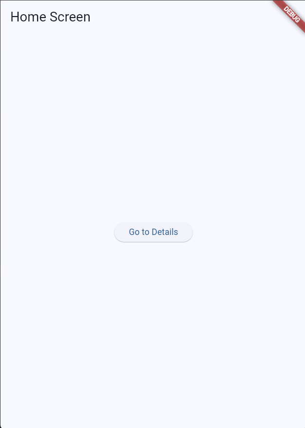
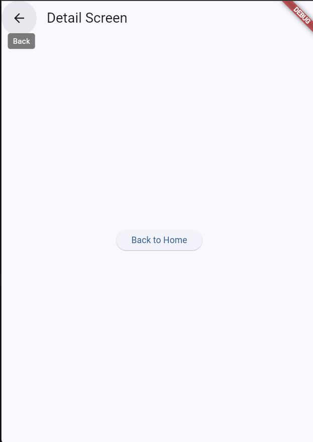

# Stack Navigation Demo

A basic Flutter app demonstrating stack navigation.

## Screens

### Home Screen

### Detail Screen

## Navigation
- `Navigator.push` adds DetailScreen to the stack
- `Navigator.pop` returns to HomeScreen
