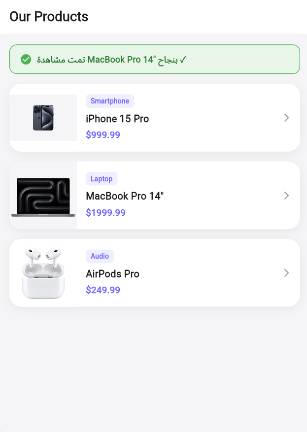

# Task 2 - Passing and Returning Data

A Flutter application demonstrating how to pass data to a new screen and return data back using Navigator.

## Screens

### Products List

### iPhone 15 Pro Details

### MacBook Pro Details

### AirPods Pro Details

## Navigation
- `Navigator.push` navigates to DetailScreen and passes product data
- `Navigator.pop` returns to ProductListScreen with a confirmation message
- Result is displayed in a **SnackBar**